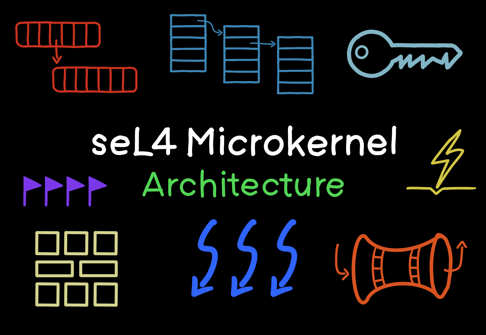
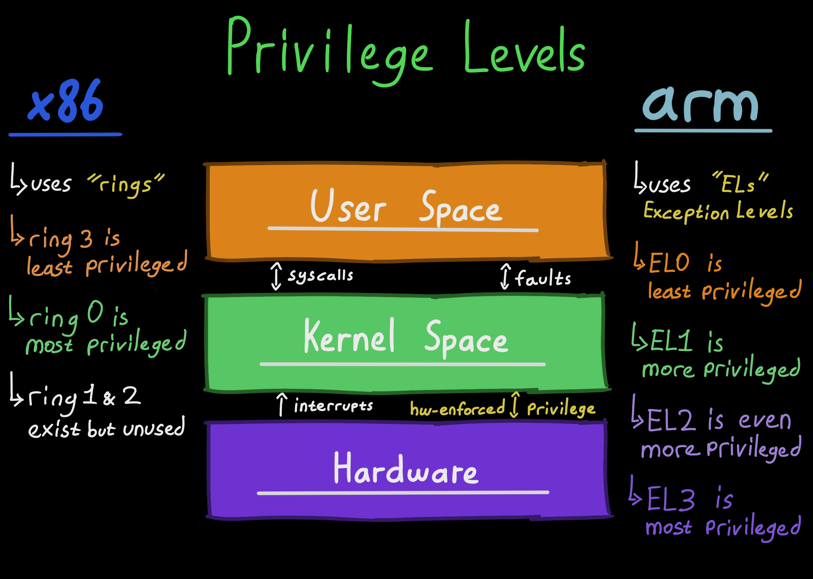
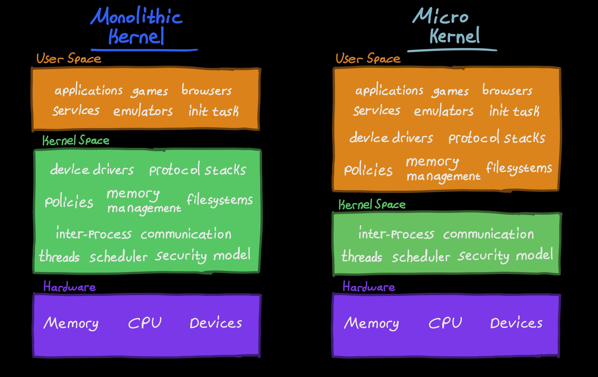
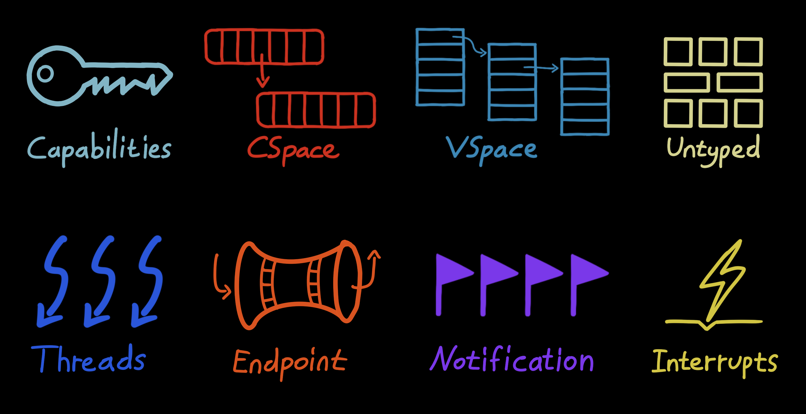
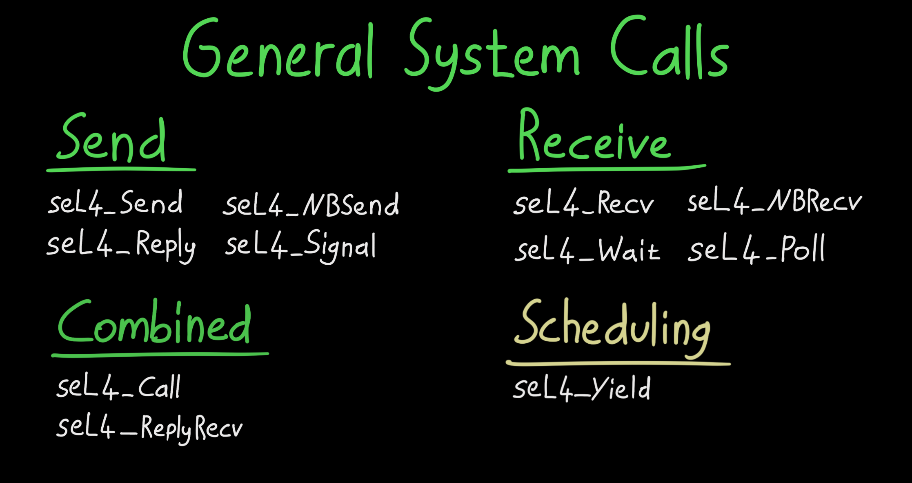
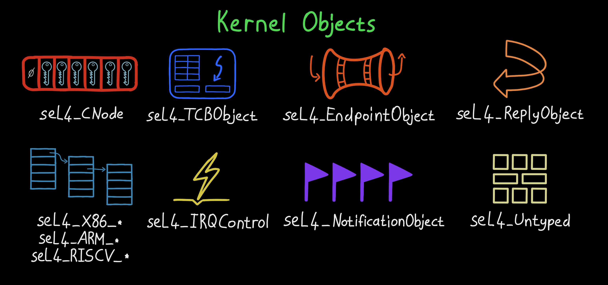
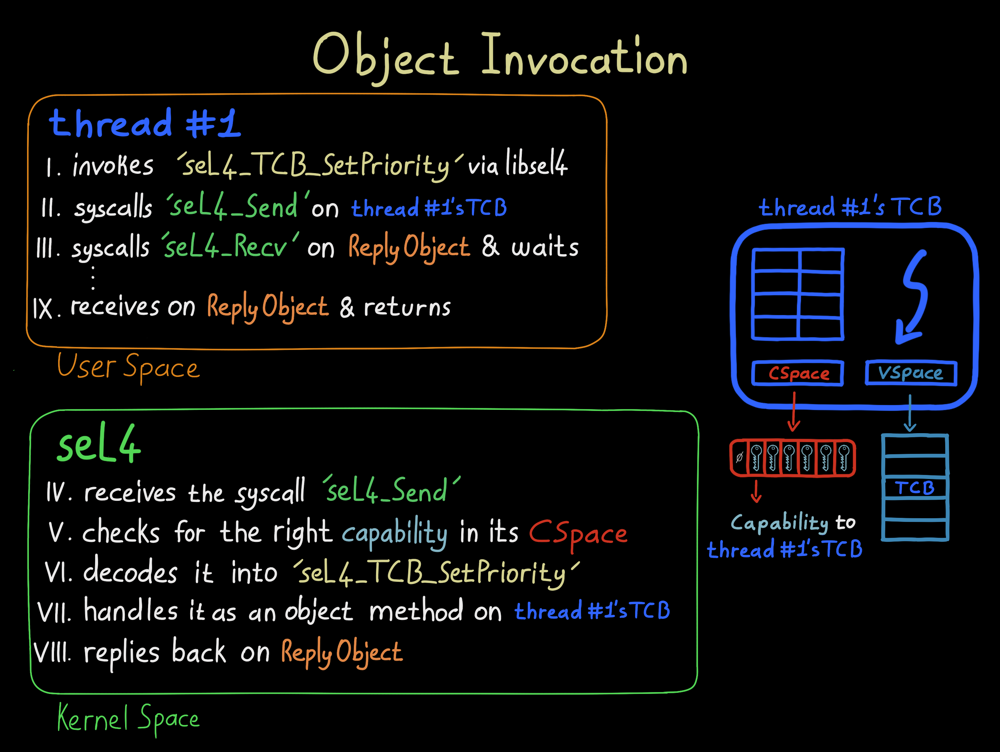
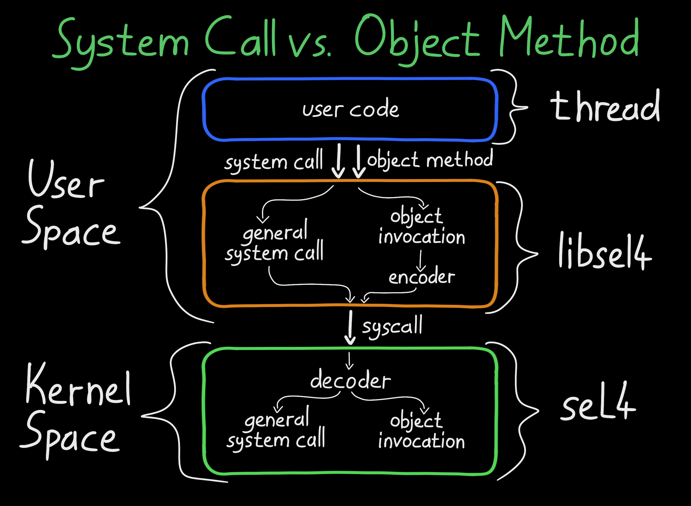
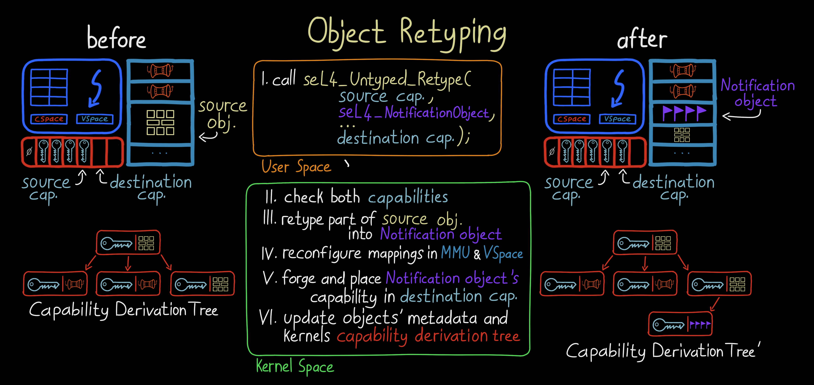
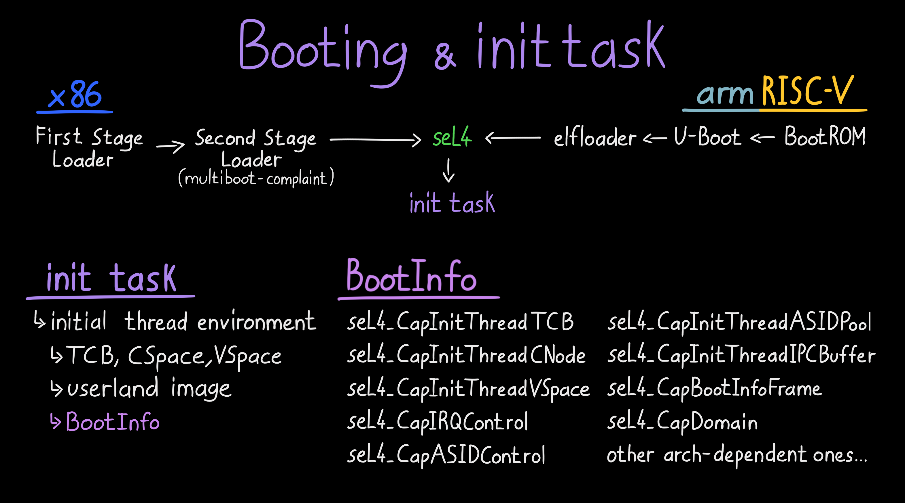

# seL4 Microkernel: Architecture

The balance between safety and security versus high-performance and high-throughput has always been a challenge in OS design. Although not mutually exclusive, making something safer usually lowers performance, which could be due to software design or hardware limitations.

To combat this, modern hardware features things like [MMUs](https://en.wikipedia.org/wiki/Memory_management_unit), [privilege levels](https://developer.arm.com/documentation/102412/0103/Privilege-and-Exception-levels) and [virtualization](https://en.wikipedia.org/wiki/Virtualization). But they alone are not enough. The software should also be designed and implemented smartly to make use of the hardware the right way. This, in turn, put great responsibility on kernels, the software that abstracts the hardware.

Privilege Levels

One of the most popular kernel designs out there is monolithic kernels, where high-performance software (e.g., drivers) resides in the kernel space. However, this brings many [safety and security risks](https://www.forbes.com/sites/kateoflahertyuk/2024/07/19/crowdstrike-windows-outage-what-happened-and-what-to-do-next/). If the software inside the kernel space fails, the entire system goes with it. One solution would be to move as much software away from the kernel as possible.

Microkernels, minimizes the software in the kernel space by only including essential software like the [scheduler](https://en.wikipedia.org/wiki/Scheduling_(computing)), [IPC](https://en.wikipedia.org/wiki/Inter-process_communication) and [interrupt handling](https://en.wikipedia.org/wiki/Interrupt_handler). This enhances system safety as there is less software that could fail. It also makes verification and validation easier as the code size is smaller. However, performance and system latency might suffer greatly if the microkernel is not designed carefully.

Comparing Kernel Designs: Monolithic and Micro

[seL4](https://beta.sel4.systems) is a fast, secure and formally verified microkernel with fine-grained access control and support for virtual machines. It is the world’s fastest microkernel, balancing both security and performance. How this balance is achieved is a feat of software design and engineering.

In this series I will be going over the mechanisms that allow safe, secure and high-performant systems to be built with seL4. I highly suggest everyone to check [the official white paper](https://sel4.systems/About/seL4-whitepaper.pdf) for a more deeper understanding on the project’s background, formal verification, objectives and real-world applications.

## Abstractions

seL4 Abstractions (a.k.a Services)

seL4 acts as a hardware abstraction layer for the software running in the user space. These abstractions are backed by well-designed, secure, yet simple mechanisms. You might already be familiar with some of them from other systems.
- Capabilities
- Threads
- Address Spaces
- Untyped
- Inter-process Communication
- Interrupts

Each abstraction and their mechanisms is quite impressive and deserve their own writing. So they will be explored in the next parts if this series.

## System Calls

seL4 General System Calls

Traditional monolithic kernels provide abstractions (services) through system calls. For instance, to create a folder in Linux, you invoke the mkdir system call with its unique syscall number `83`.

In that traditional sense, seL4 only has 11 system calls that you can invoke with a syscall number. Logically though, there is only 3.
- `seL4_Send`
- `seL4_Recv`
- `seL4_Yield`

The rest of the system calls are variations of the three above (e.g., `seL4_ReplyRecv` = `seL4_Send` + `seL4_Recv`). However, for optimization reasons, the variations are also implemented as system calls with their unique syscall numbers.

The `seL4_Yield` system call here is a unique one because it doesn’t invoke an object (explained later) and isn’t a variation of `seL4_Send` or `seL4_Recv`. See [this mailing list](https://lists.sel4.systems/hyperkitty/list/devel@sel4.systems/message/KEJXVPMZBE2X27FGD3INUGH5PPVCHBP4/) for more info on it.

## Kernel Objects

seL4 Kernel Objects

Unlike mainstream kernels, seL4’s interface to its abstractions (services) are not thru system calls, but by kernel object invocations. This is a crucial design & implementation difference.

The kernel’s interface to these objects (via system calls `seL4_Send` and `seL4_Recv`) forms the kernel’s interface itself. Kernel abstractions (services) are created, manipulated, and interfaced using the following kernel objects:
- CNodes
- Thread Control Blocks
- Endpoints
- Reply Objects
- Notification Objects
- Virtual Address Space Objects
- Interrupt Objects
- Untyped Memory
- Architecture-Specific Objects

To protect the kernel objects, seL4 uses capabilities and the system’s MMU. The kernel marks each object’s memory region as ‘protected’ on the MMU for hardware protection & isolation, while capabilities are used for access control inside seL4.

Capabilities and the types of kernel objects they reference will be explored in the upcoming writings.

## Object Methods

seL4 Object Methods (a.k.a. Invocations)

Kernel abstractions (services) are provided via invocations to kernel objects. This mechanism (or interface) is simply called object methods.

The object methods, handled inside seL4, defines what you can do with a certain type of kernel object. Alongside them, capabilities are used for secure access control and object referencing.

Each object method is actually either `seL4_Send` or `seL4_Recv` on a kernel object. For example, when you call the `seL4_TCB_Set_Priority` object method on a TCB type kernel object, you’re actually calling `seL4_Send` and `seL4_Recv` on it with a specific message (`MsgInfo_t`). In normal use, however, libsel4 abstracts this detail from you.

In seL4, object methods are implemented differently from system calls. They don’t have unique syscall numbers. Instead, there’s a decoder that uses its own numbering system similar to syscalls to determine which object method to invoke on which kernel object.
Take a look at [object-api.xml](https://github.com/seL4/seL4/blob/master/libsel4/include/interfaces/object-api.xml) to see all of the object methods. Try to compare them to [syscall.xml](https://github.com/seL4/seL4/blob/master/libsel4/include/api/syscall.xml).

Relationship Between System Calls And Object Methods

## Kernel Memory Allocation

seL4 Object Retyping And Capability Deviation Tree (CDT)

Unlike other mainstream kernels, seL4 does not use any dynamic memory allocation. Everything it needs is pre-allocated during boot (e.g., data, code, stack) and remains fixed. This helps with predictability and in turn stability of the kernel. It also eases the formal verification.

However, the kernel must track the abstractions (services) it provides via the kernel objects. seL4 cleverly implements this functionality inside the Capability Sevice Tree (CDT) thats structured using the kernel object themselves!

When the user space creates a kernel object via `seL4_Untyped_Retype`, seL4 adds additional information to the new kernel object and updates the CDT. The required book-tracking information of kernel objects are now stored within the kernel objects! And with it seL4 avoids dynamic memory allocation.

## Init Task

seL4 Simplified Booting, Initial Task And The BootInfo Structure

seL4 follows a “no-policy” design approach by providing only the mechanisms for enforcing security and access control, but it doesn’t impose specific policies on their use. The responsibility, however, must be given to someone and that is the init task (a.k.a. root task).

After the seL4 kernel boots, an initial thread is created and all system resources (e.g., untyped memory, interrupt control, user image) are given to it in a well-defined way via the BootInfo structure. It is then the responsibility of this task to set up the normal world such as drivers, filesystems and system services using the given resources.

To give a niche detail, since seL4 lacks any storage drivers or filesystems, loading the init task from a disk is impossible. To resolve this, both the seL4 kernel and the init task are either loaded by another bootloder called elfloader in ARM & RISCV or by a multibiot-complient Second Stage Loader in x86.

After starting the init task, seL4 begins operating. What happens next is totally up to you!
